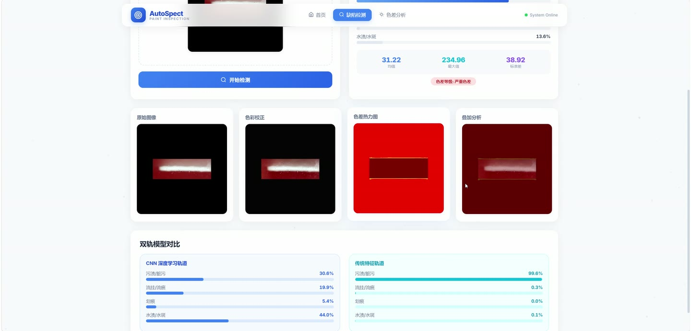
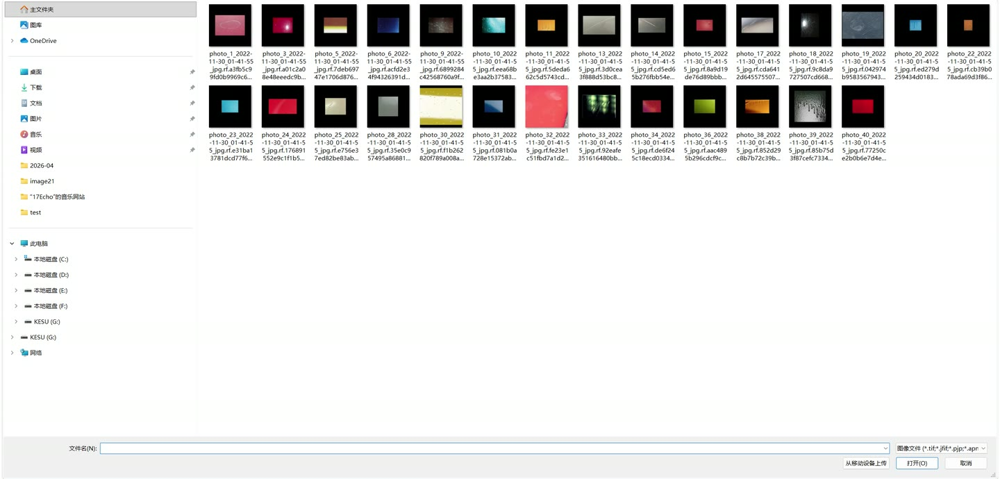
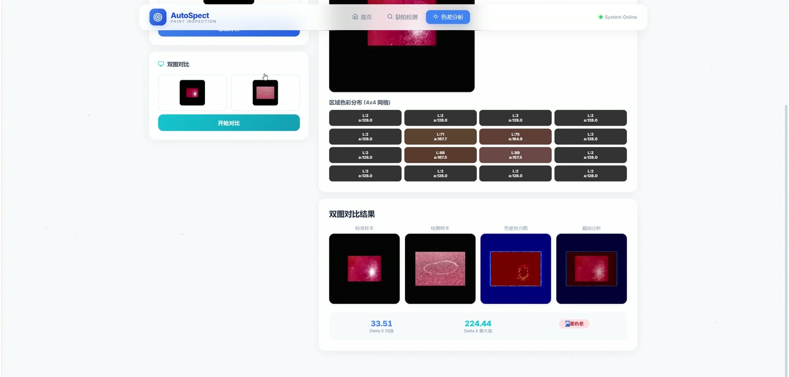
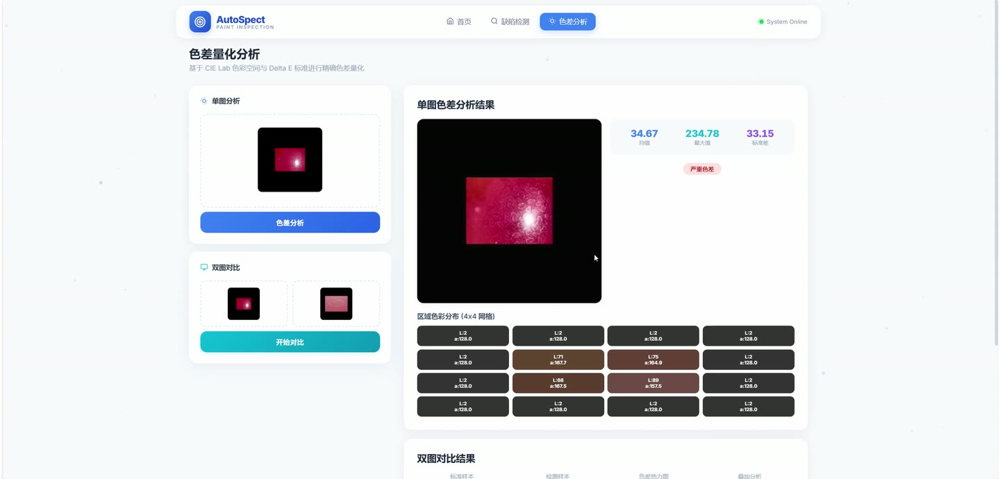
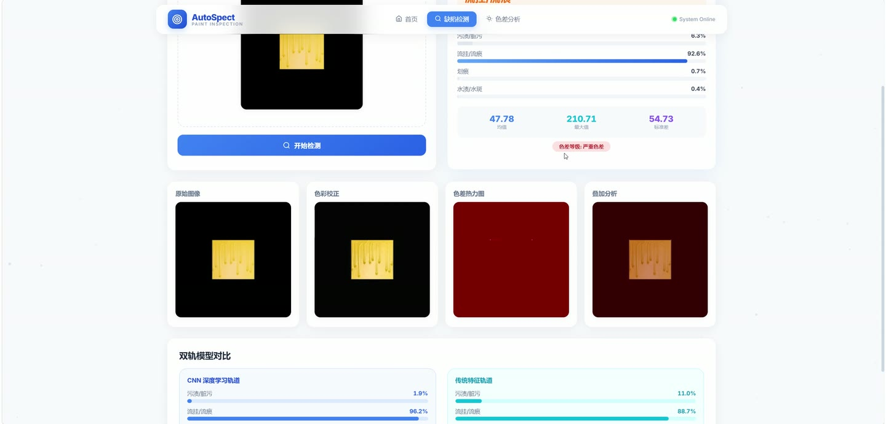
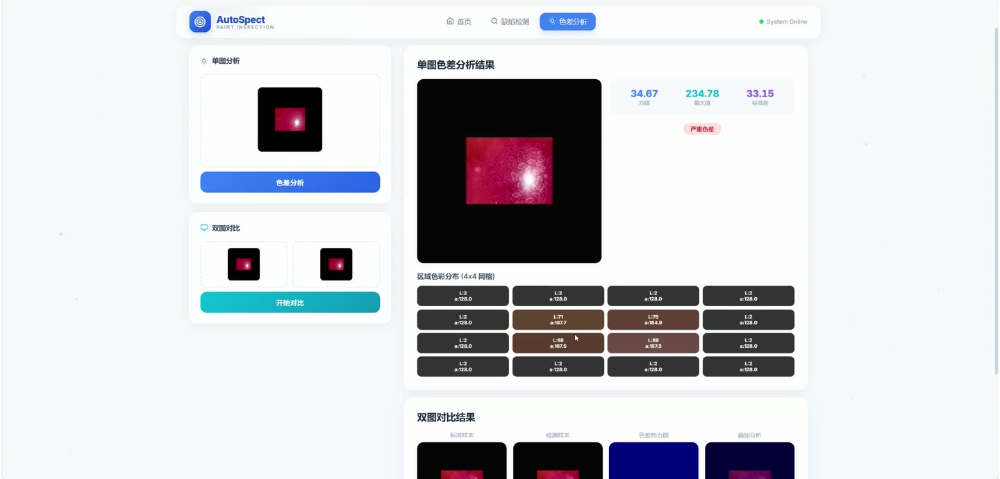

# (附文档)Python+深度学习+PyTorch 汽车漆面色差视觉检测系统

**技术栈**：Python、Flask、PyTorch、深度学习

### 系统简介

本系统是一套基于 Python 与 PyTorch 的汽车漆面色差视觉检测系统，采用前后端分离架构，后端通过 Flask 提供 REST 接口并加载深度学习模型完成推理，前端提供可视化操作界面。系统面向检测人员与模型维护人员两类角色，支持漆面缺陷识别、色差量化分析、图像对比与数据集管理。
 
### 核心功能
 
### 检测人员端

 
- 上传单张汽车漆面图片进行检测，接口自动解码图像并保存至上传目录，返回缺陷类别与置信度。 
- 查看融合预测结果，系统按 CNN 与传统分类器各自置信度进行加权融合，输出最终类别与各类别概率。 
- 分别查看 CNN 分支概率与传统颜色特征分类器分支概率，便于对照两种模型的判定差异。 
- 查看色差量化结果，包括整体色差值、色差等级判定与色差分布图。 
- 查看色差热力图与叠加图，热力图以 Delta-E 色差映射生成，叠加图将热力图与原图融合展示。 
- 查看区域颜色统计，系统按区域计算颜色均值与统计指标，定位色差集中区域。 
- 查看颜色分布数据，获取图像的颜色分布直方图信息用于辅助判断。 
- 查看预处理图与色彩校正图，系统采用 CLAHE 方式进行色彩校正并返回对比图。 
- 使用双图对比功能，同时上传两张图片，以第二张为参考分析第一张的色差并生成热力图与叠加图。 
- 调用纯色差分析接口，仅返回色差、区域统计、颜色分布以及 HSV 与 Lab 特征向量，不进行缺陷分类。
 
### 模型维护人员端

 
- 查看模型加载状态，接口返回 CNN 模型与传统分类器是否已成功加载。 
- 查看模型基础信息，包括类别名称列表、输入图像尺寸与当前推理设备。 
- 查看训练历史，读取训练过程中保存的损失、准确率等曲线数据。 
- 查看数据集统计，按 train、valid、test 三个划分返回样本总数与各类别样本数量分布。 
- 分页浏览数据集图像，支持指定划分与每页数量，返回缩略图与对应类别标签。 
- 随机抽取样本对，从训练集中随机取两张图片及其标签，用于快速对比演示。 
- 执行模型训练流程，脚本依次完成数据增强、数据加载、CNN 训练、测试评估与传统分类器训练。 
- 采用两阶段迁移学习训练，第一阶段冻结骨干仅训练分类头，第二阶段解冻全部层并以更低学习率微调。 
- 训练中启用标签平滑与余弦退火学习率调度，并按验证集准确率保存最优模型权重。 
- 训练完成后输出测试准确率、分类报告与混淆矩阵，并将训练历史写入 JSON 文件。 
- 训练传统颜色特征分类器，基于提取的颜色特征拟合模型并保存为本地模型文件。
 
### 系统通用端

 
- 健康检查接口，返回服务运行状态与当前时间戳。 
- 前端页面路由，访问根路径或任意路径均返回统一的可视化操作页面。 
- 跨域支持，后端启用 CORS 以便前端独立调用各接口。
 
### 技术栈

 后端框架Flask、Flask-CORS 深度学习框架PyTorch、TorchVision 模型结构ResNet18 迁移学习、轻量 CNN、传统颜色特征分类器 图像处理OpenCV、NumPy、Pillow、CLAHE 色彩校正 数据处理Pandas、scikit-learn、自定义 Dataset 与 DataLoader 前端技术HTML 模板渲染、Base64 图像展示、REST 接口调用 数据存储CSV 类别标注文件、本地模型权重文件、JSON 训练历史 运行设备自动检测 CUDA，支持 GPU 与 CPU 推理
 
### 交付内容

 
- 后端完整源码 
- 前端完整源码 
- 数据库初始化脚本 
- 万字文档

## 界面展示

---

## 获取完整源码 + 万字文档

本仓库为项目介绍页。**完整前后端源码、数据库初始化脚本、万字项目文档**，请加微信 `kangkangcode`，或访问 [codekk.top](http://codekk.top) 获取。

可作课程设计 / 毕业设计参考，支持远程部署调试。